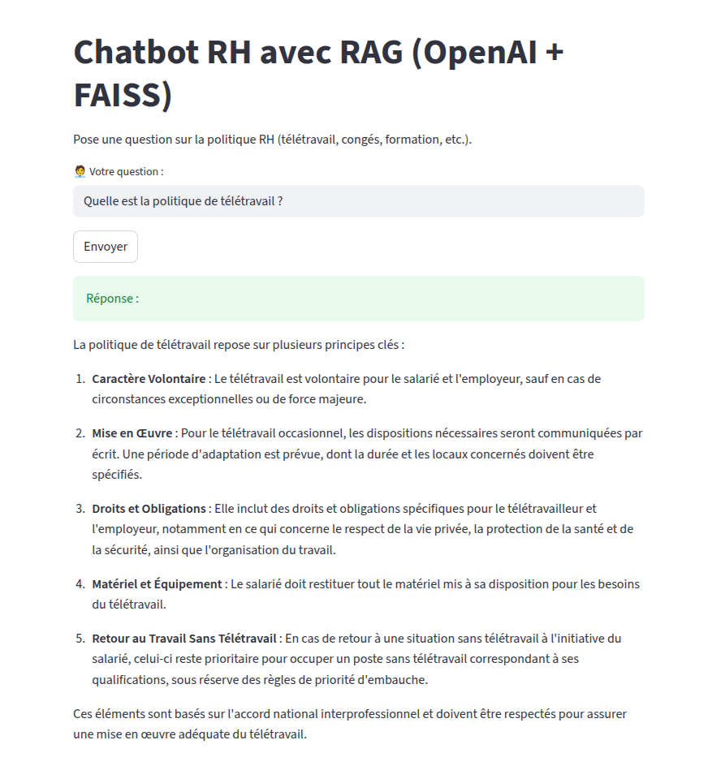
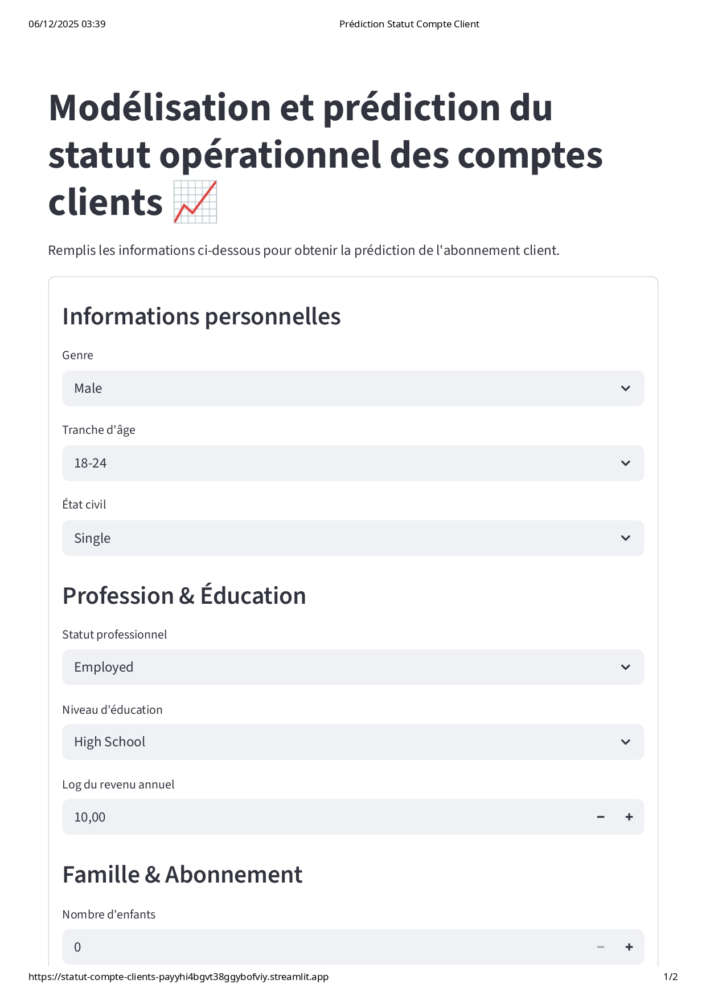
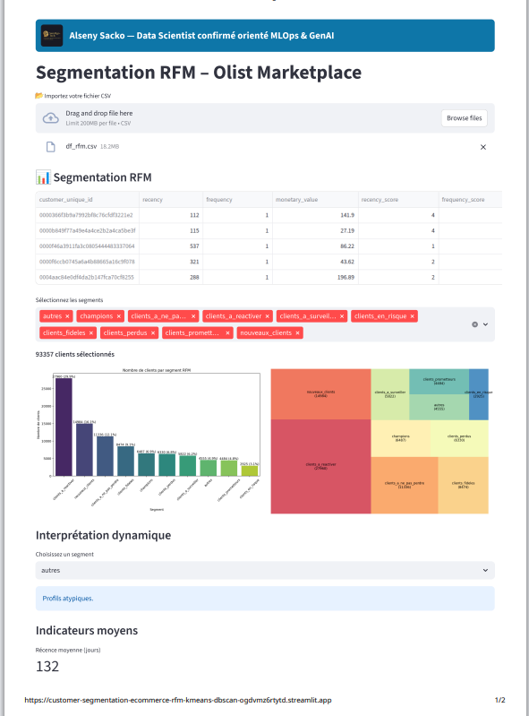

### Data Scientist spécialisé en MLOps et Intelligence Artificielle – Activité indépendante

**Prestations de services en data science, automatisation, modèles de machine learning et solutions d’intelligence artificielle.**

En tant qu’expert en data science, je vous accompagne dans la transformation de vos données en leviers stratégiques. Grâce à l’extraction d’insights pertinents et au développement de modèles intelligents, j’apporte une vision éclairée pour optimiser vos prises de décision. Mon agilité, ma curiosité analytique et mon approche proactive constituent des atouts majeurs pour toute entreprise souhaitant affiner sa stratégie et améliorer l’efficacité de ses processus décisionnels. 
Je privilégie des solutions analytiques performantes, durables et adaptées aux enjeux spécifiques de votre activité.
#### Formations
- Machine Learning Enginner
- Master Data Science
- Certificat Data Science

#### Compétences clés.

**Machine Learning :**
- Machine Learning & Deep Learning
- Scikit-Learn, XGBoost, Random Forest
- NLP (transformers, embeddings), clustering
- Feature engineering & optimisation des modèles
- Optimisation : GridSearch, Optuna, Random Search
- Évaluation : AUC, F1-Score, confusion matrice
- Interprétabilité : SHAP, LIME
- Évaluation robuste : cross-validation, tests statistiques
  
**IA & NLP :**
- Systèmes RAG (Retrieval-Augmented Generation)
- LLMs (GPT, Mistral, Zephyr, LLaMA 3)
- Fine-tuning modèles open-source (HuggingFace)
- Tokenisation, embeddings, FAISS, vector databases
- Prompt engineering & prompt optimisation
  
**MLOps & Déploiement :** 
- Docker, Docker Compose
- GitHub Actions (CI/CD)
- MLflow (tracking, versioning, registry)
- Déploiement Streamlit Cloud, HuggingFace Spaces, Render, Azure ML
- Monitoring des modèles (drift, performance, latence)
- Packaging, pipelines, automatisation
  
**Backend & Dev :**
- Python (avancé), FastAPI (API ML), Streamlit (UI ML)
- Pipelines ETL/ELT
- Gestion des environnements (conda, venv), Makefile
- Tests unitaires (pytest), logging structuré
  
**Data Engineering :**
- SQL, PostgreSQL
- Data modeling, star schema
- Extraction et transformation de données
- Gestion de données semi-structurées (JSON, XML, parquet)

**Cloud & DevOps :**
- Azure ML / Azure Storage
- HuggingFace Spaces
- Streamlit Cloud
- Git & GitHub avancé
- Automatisation CI/CD
  
**Outils :**
- Python · Pandas · NumPy · Scikit-learn · FAISS · LangChain · HuggingFace · Transformers
- Docker · Git · GitHub Actions · MLflow · Streamlit · FastAPI · SQL

#### Expériences
🔹Data Scientist | Covéa | [Dates]
📍 Paris, France.
- Optimisé la tarification MRH en développant un modèle dynamique (Python, SQL), réduisant l’écart-type des primes de 15 %.
- Analysé 10M+ sinistres auto (PySpark, SQL), identifiant des facteurs de risque et réduisant les coûts d’indemnisation de 10 %.
- Renforcé la lutte antifraude en implémentant un modèle IA (Random Forest, Gradient Boosting), améliorant la détection de 30 %.
- Industrialisé le scoring de fraude via AWS Sagemaker, réduisant le temps de détection de 40 %.
- Déployé des dashboards interactifs (Power BI, Tableau), optimisant l’interprétation des insights métiers.

🔹Data Scientist | Ufirst Advisory | [Dates]
📍 Paris, France.
- Optimisé le traitement des données (+50M lignes) avec SQL, Pandas, PySpark, réduisant le temps de préparation de 30 %.
- Exploré et visualisé les données (Matplotlib, Seaborn, Plotly), améliorant l’analyse exploratoire et la prise de décision.
- Amélioré les prévisions de vente de 15 % via des modèles prédictifs avancés (XGBoost, LightGBM, Random Forest).
- Automatisé le déploiement des modèles (Docker, AWS Lambda), réduisant le time-to-production de 40 %.
- Restitué des insights clairs en Power BI, Tableau, Dash, facilitant la prise de décision métier.

🔹 Chargé d'études statistiques | Altocis-P.S.| [Dates]
📍 Paris, France.
- Conçu des dashboards dynamiques (Excel, Power BI), clarifiant les insights pour la direction.
- Automatisé le suivi des KPI, réduisant le temps d’analyse de 30 %.
- Géré 500+ documents comptables (SQL, Excel VBA), assurant une saisie de données précise.
- Fournit des analyses stratégiques, influençant les décisions opérationnelles.
- Optimisé la planification des agents, réduisant les conflits d’horaires de 25 %.

#### Projets: 
### Projet 1 : Assistant RH Intelligent basé sur l’IA Générative (RAG + LLM + FAISS).
[Code source GitHub | Démo interactive](https://github.com/DataEngineer87/Chatbot-Rh-Rag?tab=readme-ov-file)
#### Démo :

**Objectif du projet**

Les entreprises, disposent des informations RH (télétravail, congés, formation, primes...) sont souvent dispersé dans des fichiers PDF longs et difficiles à consulter.
Ce projet a pour objectif La mise en palce d'un assistant IA capable de :
- Comprendre une question RH en langage naturel
- Rechercher automatiquement la réponse dans les documents PDF internes
- Générer une réponse claire et contextualisée.

**Technos**
- OpenAI, HuggingFace, LangChain, FAISS 
- Streamlit, GitHub Actions

**Fonctionnalités**
- Extraction PDF RH
- Embeddings MiniLM + index FAISS
- RAG complet : recherche + génération
- Streamlit UI
- CI/CD GitHub Actions
- Déploiement Streamlit Cloud
  
**Impact**
- Accélère l’accès à l’information RH
- Réduction du temps RH / collaborateurs
- Démonstration complète d’un projet IA bout-en-bout
  
**Solution technique**

Développement d’un système **RAG** complet (PDF → embeddings → LLM)
- 0% hallucinations grâce à un filtrage strict basé sur la similarité vectorielle
- Gestion multi-PDF pour un référentiel RH complet
- Architecture modulaire : API indépendante de l’UI
- Compatible 100% Open-Source (version HuggingFace)
- Compatible OpenAI pour une qualité premium 

**Compétences démontrées**
- IA Générative (RAG complet)
- NLP avancé
- Vector Search (FAISS)
- HuggingFace embeddings + LLM
- Streamlit front-end
- Gestion des secrets & configuration streamlit cloud
- Structuration professionnelle de projet IA

#### Projet 2 : Prédiction du Statut de Compte Client
[Code source GitHub | Démo interactive](https://github.com/DataEngineer87/Statut-Compte-Clients)
#### Démo :

**Objectif du projet**
- Développement et industrialisation d'un système complet capable de prédire automatiquement le statut d’un compte client (actif, dormant, à risque…) 
  grâce à un pipeline Machine Learning entièrement orchestré en MLOps.
  Le projet combine FastAPI, Docker, GitHub Actions, MLflow, Streamlit Cloud et SHAP pour un cycle de vie ML industrialisé, traçable et explicable.

**Ce projet vise à :**
- Réduire la charge opérationnelle de tri et contrôle manuel des comptes.
- Fiabiliser la prise de décision via un modèle explicable.
- Automatiser l’entraînement, l’évaluation, le déploiement et le monitoring du modèle.
  
**Résultats obtenus**
- Pipeline MLOps complet : entraînement → tests → tracking → déploiement → monitoring.
- API FastAPI conteneurisée (Docker) mise en production via GitHub Actions (CI/CD).
- Dashboard Streamlit Cloud pour réaliser des prédictions en ligne.
- Tests unitaires (pytest) automatisés à chaque push GitHub.
- Analyse SHAP pour expliquer les prédictions en détail.
- Versioning complet des modèles et métriques via MLflow.
- Monitoring continu : suivi des dérives de données et de performance.

**Stack technique**
- Python, FastAPI, Docker, GitHub Actions, MLflow,
- Streamlit, SHAP, scikit-learn, pandas, pytest

#### Caractéristiques techniques du pipeline
**Préparation & Feature Engineering**
- Nettoyage, encodage, imputation.
- Sélection d’attributs basée sur importance.
- Standardisation dynamique pour éviter les fuites.

**Entraînement du modèle**
- Modèle choisi : Random Forest.
- Hyperparameter tuning automatisé.
- Logging automatique dans MLflow Tracking : métriques (accuracy, f1-score, recall…), paramètres, artefacts, modèle picklé

**CI/CD avec GitHub Actions**
- Déclenchement automatique à chaque push : Installation de l’environnement, Exécution des tests unitaires (pytest), Construction Docker,
  Déploiement automatique de l’API

**API FastAPI**

Endpoint principal : POST /predict -> renvoie :
- classe prédite
- explication SHAP

**Interface Streamlit**

Accessible en ligne :
- upload direct de CSV
- prédiction individuelle 

**Explicabilité (Explainable AI)**

Analyse produite par SHAP :
- Importance globale des variables
- Importance locale pour chaque prédiction
  
Cela rend le modèle audit-compatible pour les métiers (finance, risque, conformité).

**Impact business**
- Automatisation d’un processus métier critique
- Suppression des erreurs humaines
- Explicabilité conforme aux attentes légales
- Accélération du temps de décision
- Solution déployée en environnement cloud

### Projet 3 : Segmentation Client Avancée - RFM, K-Means & DBSCAN
[Code source GitHub | Démo interactive](https://github.com/DataEngineer87/Customer-Segmentation-Ecommerce-rfm-kmeans-dbscan)

#### Démo :

**Technologies :** 

- Python
- Pandas
- Scikit-learn
- Plotly
- Streamlit
**Méthodes :**
- RFM
- Means
- DBSCAN
**Domaine :**
- Customer Analytics
- Marketing Intelligence

**Objectif**

Concevoir une segmentation client exploitable business pour prioriser les actions marketing, CRM et fidélisation dans un contexte e-commerce réel.

**Approche**
- RFM : mesure de la valeur client (VIP, à risque, nouveaux, perdus)
- K-Means : segmentation comportementale non supervisée
- DBSCAN : détection des clients atypiques / anomalies
- Fusion des résultats dans une vue stratégique unique

**Résultats**
- Typologie finale : VIP · À Risque · Standard · Atypiques
- Interprétation automatique des segments
- Dashboard interactif Streamlit
- Export de clients actionnables
- 
**Projet orienté décision business, prêt pour un déploiement cloud.**

